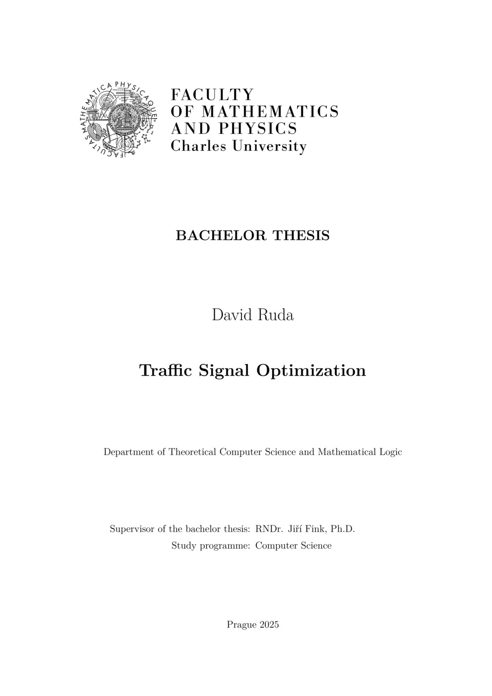
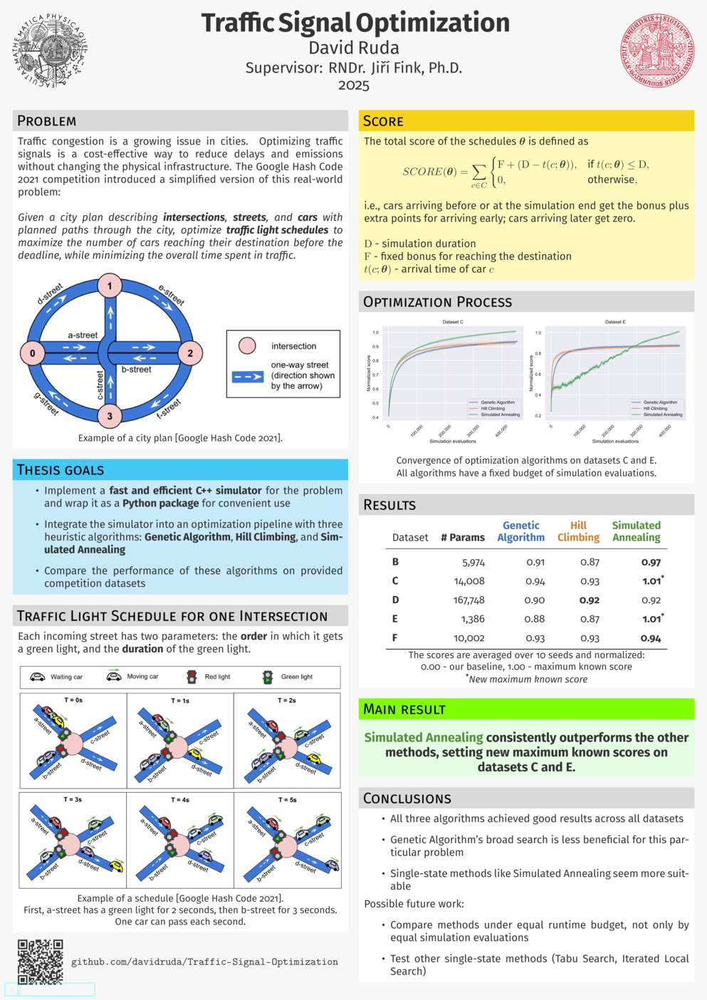

# Bachelor Thesis

This repository contains the LaTeX sources for my bachelor thesis named __Traffic Signal Optimization__, available at [hdl.handle.net/20.500.11956/206702](https://hdl.handle.net/20.500.11956/206702).

For the source code of the technical part of the thesis (simulator, optimization algorithms, experiments), please refer to the [Traffic Signal Optimization](https://github.com/davidruda/Traffic-Signal-Optimization) repository.

## Abstract

_As cities grow and traffic congestion worsens, traffic signal optimization is becoming an increasingly important real-world problem for ensuring efficient urban mobility.
This thesis explores a simplified version of this problem, originally presented in the Google Hash Code competition.
The task involves optimizing the schedules of traffic lights at city intersections to maximize the number of cars reaching their destinations before a deadline, while minimizing the overall time spent in traffic.
We develop a fast and efficient simulator to evaluate solutions for the task.
We then integrate this simulator into an optimization pipeline with three heuristic algorithms: Genetic Algorithm, Hill Climbing, and Simulated Annealing. We experimentally compare these algorithms on the provided datasets, achieving new best scores on two datasets._

<table align="center">
  <tr>
    <td align="center">
      <a href="https://davidruda.github.io/bachelor-thesis/thesis.pdf">
<!--
convert -density 600 thesis/thesis.pdf[0] -resize 20% -alpha remove assets/thesis-small.jpg
-->
        
      </a>
       
      <a href="https://davidruda.github.io/bachelor-thesis/thesis.pdf"><big>Thesis</big></a>
    </td>
    <td align="center" width="50"></td> <!-- spacing between images -->
    <td align="center">
      <a href="https://davidruda.github.io/bachelor-thesis/poster.pdf">
<!--
convert -density 300 poster/poster.pdf -resize 10% assets/poster-small.jpg
-->
        
      </a>
       
      <a href="https://davidruda.github.io/bachelor-thesis/poster.pdf"><big>Poster</big></a>
    </td>
  </tr>
</table>
